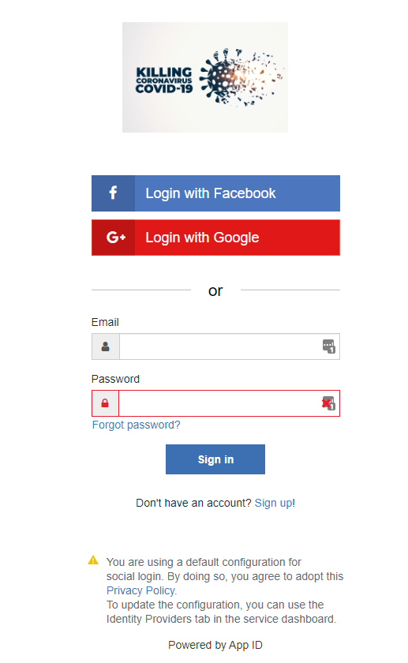
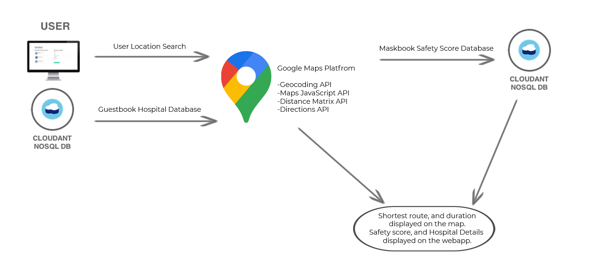
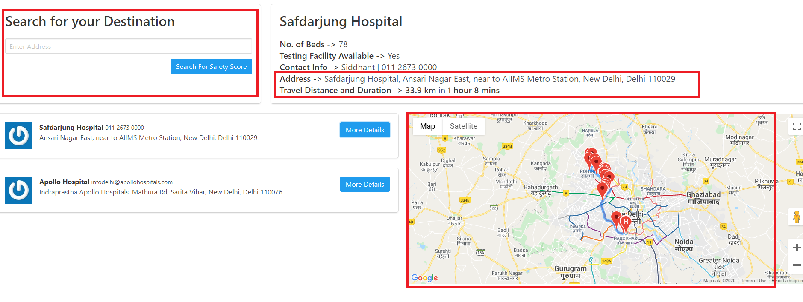
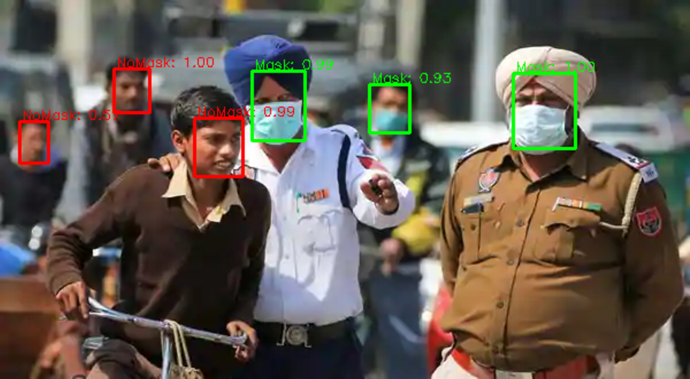

# TEAM REGRESSION
 
 IBM Crack the COVID Hackathon

## Authors
 - [Siddhant Dangi](https://www.linkedin.com/in/siddhant-dangi-8b9707153/)
 - [Jivat Neet Kaur](https://www.linkedin.com/in/jivat-neet-14a4b0187)
 - [Honnesh Rohmetra](https://www.linkedin.com/in/honnesh-rohmetra/)
 - [Abhishek Agarwal](https://www.linkedin.com/in/abhishek-agarwal-003623166/)
          
## Contents
1. [Overview](#overview)
2. [Video](#video)
3. [The idea](#the-idea)
4. [How it works](#how-it-works)
5. [Documents](#documents)
6. [Datasets](#datasets)
7. [Technology](#technology)
8. [Running the App](#running-the-app)
9.  [Getting started](#getting-started)
10. [License](#license)

## Overview

### What's the problem?

In times of crisis, there are multiple issues which affect the community and we're trying to solve a few of them. As the number of Covid-19 cases continue to rise, the number of people seeking treatment will overwhelm many hospitals. Having a handle on local hospitals’ capacity and resource availability could help balance the load of Covid-19 patients requiring hospitalization across a region by allowing medical staff to send a patient to a facility where they are more likely to be treated quickly. But many states lack real-time data on their current capacity to treat Covid-19 patients. 

Another issue we'll be witnessing with the relaxation of lockdown restrictions is when people will be stepping out to go to work, purchase essentials and carry out other activities. But, normalcy has not returned and the hesitation and fear of safety will still affect people when they think about stepping out. A live monitoring of the safety status of locations around people will help manage crowd and the safety scenario in an efficient manner.

### How can technology help?

Technological advancement with a blend of machine learning, software development and connectivity through applications can equip the mankind with abilities to fare through this pandemic in a safer and smarter way. 

A web application can be designed to help everyone - those have been affected as well as those who haven't been yet. Providing the people essential statistics and services can make them aware of the current safety scenario at different locations. For the patients, real-time statistics of hospital capacity and other resources stored on the IBM Cloudant database can aid them in reaching to the best possible treatment as quicky as possible.

## Video

### IBM Hackathon video script

**Problem Description:**
As the number of Covid-19 cases will continue to rise, the number of people seeking treatment will overwhelm hospitals. Often the treatment centers have no availability of beds and are already working at full capacity, which leads to inefficiency and confusion in communication while admitting patients to these treatment centres, leading to a risk of life. Having a handle on local hospitals’ capacity and resource availability could help balance the load of Covid-19 patients who are requiring hospitalization by sending a patient to a facility where they are more likely to be treated quickly. But there is no unified platform with real-time data on the current capacity and resources to treat Covid-19 patients.

Another issue we'll be witnessing with the relaxation of lockdown restrictions is when people will be stepping out to go to work, purchase essentials and carry out other activities. But, normalcy has not returned and the hesitation and fear of safety will still affect people when they think about stepping out. A live monitoring of the safety status of locations around people will help manage crowd and the safety scenario in an efficient manner.

**Solution:**
To address the need of a real-time tracking system for Covid-19 beds and hospital resources, our team designed a website with a live Hospital Resource Monitoring Dashboard **[Display the dashboard]**. If you are a patient and need assistance, you can find information regarding nearby hospitals, bed capacity and test availability. If you are a nurse, doctor, health department or state, you can use the Hospital Dashboard Login **[Display the form and real-time updation feature, mention IBM AppID for login]** and share information on the current hospital capacity. **[Details about implementation - using IBM cloudant for the database]** We are using the IBM cloud service Cloudant to design and manage our database for Hospital records.

If you are thinking about stepping out to buy something from the shopping complex or need to get something repaired and are worried about the safety scenario out there, we're tracking the safety score of all the places onboard through their live video camera feed. The video feed is processed every 10 minutes locally and the number of people present and the percentage of people wearing masks is calculated using our mask detection model **[show the model architecture and model results on a video]**. The latitude and longitude of the location, number of people and safety score indicated by the % of people wearing masks is stored in a JSON document. IBM Cloudant database is used to store the location info and corresponding safety scores. If the location info pre-exists on the database, the safety score is simply updated.

The user can view the safety score for their destination location through the search option on our app **[Zoom into 'Search for your destination']**. This allows efficient social distancing management, safety monitoring and will be helpful in avoiding overflow of people in places at any point of time.

The map in tha app displays the route to the destination along with the Travel Distance and duration. **[Focus on map]**
Our solution aims to solve multiple issues posed by the Covid-19 crisis and if the concerned authorities come onboard, it can be resourceful to patients, doctors, emergency medical personnel and all the other users beyond measure. 
 
## The Idea
With the rapid spread of COVID-19 it has become increasingly difficult for the patients who test positive to be accommodated in the treatment centers. Often the treatment centers have no availability of beds and are already working at full capacity, which leads to inefficiency and confusion in communication while transferring patients from a COVID-testing facility to these treatment centres, leading to a risk of life. 

Our application provides a platform for the hospitals to share real-time statistics like number of beds available, presence of testing facilities and number of **ventilators?** which can significantly help the patient reach the required resources as soon as possible. The data is stored on a hospital monitoring database hosted on IBM's cloud-based service, Cloudant which is used to setup a NoSQL Database which then can be used with a serverless web application. 

For the people who have not been not infected yet, the most worrying concern is the ground situation of the places that they are planning to visit. Once the lockdown gets lifted, huge numbers of people would take to the streets and the risk of the uncontrolled spread of virus is unfathomable. 

The application provides the user with a close real-time approximate of the number of people present at any given location, which helps the user make an aware decision. With the help of deep learning, a mask detection model is also trained and integrated with the app which calculates the safety score of a place based on the percentage of people wearing masks, using the live footage from CCTV cameras installed there. This ratio is extremely essential as it gives an idea to the user about the level of risk he/she might take. For publicly crowded places like markets and shopping centres, this application is furthermore crucial as the safety score can clearly convey the peril of visiting the place and allow efficient social distancing management, safety monitoring and will be helpful in avoiding overflow of people in places at any point of time.

## How it works

### Integration of Hospital Monitoring Database with the web application

### 1. Authentication
- Hospital Dashboard Login (Insert screenshot with hospital db login button)

***App ID by IBM*** is used to monitor authentication for the login procedure in the app. Only hospitals will be authorised to input data into the form at dataentry.html. If an unauthorised person does so, an alert message shows up and the user is prompted to login. Their input will not be recorded until they are authorised. The workflow for the App ID looks as follows:-

 
The file ***app.js*** creates an Authentication Strategy based on App ID. On a call to `/appid/login`  it goes on the authentication page, and in case of success redirects to `/dataentry.html`. From that page, a click on the logout button, initiates a call to `/appid/logout` and the user is again directed to `/index.html`. A successful login also sends a response via `/api/user` which contains the user's name and the login ID. The username and ID information is also stored along with hospital data to identify the user who filled the data, and hence enable the user to update the records for the same hospital in the future.(Update Feature - Partial Implementation).

 
 
 
  IBM Cloud ID, Login via Google and Login via Facebook have been set as Identity Service Providers.

  

### 2. Hospital Monitoring Database
IBM's cloud-service Cloudant is used to host the Hospital Monitoring Database containing real-time statistics on the presence of covid-19 test facility and number of beds and **ventilators?** available. Cloudant is used to setup a NoSQL Database which then can be used with a serverless web application. 

The details filled by the hospital post login, are sent to the guestbook database (Hospital Monitoring Database) on click of the `Submit Details` button.

A GET request is also made to the database to retrieve the data regarding hospitals onboard which is displayed on the ***Currently Onbaord*** tab of the web app. On clicking the `More Details` button, all the details for the particular hospital are retrieved and made visible to the user.

### Integration of the web application with Google Maps Platform

When the user inputs a specific location in `Search for your Destination` bar or clicks on the `More Details` button for a hospital, the location address string is retrieved and sent to the ***Geocoding API***, which finds the latitude and longitude for the place. Then using the ***Directions API***, the shortest route to the destination is computed and displayed on the map. The ***Distance Matrix API*** finds the distance and travel time required to reach the destination.

### Prediction of Safety score with Mask Detection Model

### 1. Architecture

  
The model takes input in the form of a live videostream and processes it frame by frame using OpenCV in Python.
We used the structure of SSD (Single Shot Detector). However, to enable inference on the device integrated with the CCTV camera with minimum latency, the backbone network is lite. 

The total model has 1.01M parametes. Input size of the model is 260x260, the backbone network has 8 conv layers. Overall, the model has 24 layers with the location and classification layers included.
We merge the BatchNormalization to Conv layers in order to accelerate the inference speed.

### 2. Integration of live Video feed with Mask Detection model to predict Safety score (Honnesh + Jivat)

- How model takes video feeds and continuously looping
- Predict score based on % of people wearing masks at equally separated frames (10 min feed) and return avg safety score and avg no of people

### Integration of location-based Safety score with the web application

***IBM Cloudant*** is used to setup a NoSQL Database which then can be used with a serverless web application. The Python script uploads data points such as no of people in the camera feed, safety score (based on % of people wearing masks), latitude and longitude of the camera location to the Cloudant mapbook database. The data is retrieved via a GET request, and then based on the user's location entry in the input bar, the database is searched for an entry. If a camera feed is found in the region, the score associated with it is retrieved and displayed to the user. The web app also keeps a track of the average score in all the places that are being monitored.

## Documents

### Documentation

- [IBM Cloudant Documentation](https://cloud.ibm.com/docs/Cloudant?topic=Cloudant-getting-started-with-cloudant)
- [python-cloudant documentation](https://python-cloudant.readthedocs.io/en/stable/getting_started.html)
- [Watson Studio Documentation](https://dataplatform.cloud.ibm.com/docs/content/wsj/getting-started/welcome-main.html?audience=wdp&context=wdp)
- [Directions Service-Google Maps API](https://developers.google.com/maps/documentation/javascript/directions)

### Tutorials

- [Creating and populating a simple IBM Cloudant database on IBM Cloud](https://cloud.ibm.com/docs/Cloudant?topic=Cloudant-creating-and-populating-a-simple-ibm-cloudant-database-on-ibm-cloud)
- [Build models in IBM Watson Studio](https://developer.ibm.com/technologies/artificialintelligence/tutorials/watson-studio-using-jupyter-notebook/)

## Datasets

- [Face Mask Dataset](https://drive.google.com/file/d/1QspxOJMDf_rAWVV7AU_Nc0rjo1_EPEDW/view) - [WIDER Face](http://shuoyang1213.me/WIDERFACE/) and [MAFA](http://www.escience.cn/people/geshiming/mafa.html) (MAsked FAces) datasets have been combined to form the Face Mask Dataset after correction of wrong annotations

## Technology

### IBM Technology*
- [IBM Cloudant](https://cloud.ibm.com/docs/Cloudant?topic=Cloudant-getting-started-with-cloudant)
- [IBM App ID](https://cloud.ibm.com/docs/appid?topic=appid-getting-started)
- [IBM Functions](https://cloud.ibm.com/docs/openwhisk?topic=openwhisk-getting-started)

### Open source Technology

- [Google Maps Platform](https://developers.google.com/maps/documentation)
- [Bulma](https://bulma.io/)
- [Handlebars](https://handlebarsjs.com/)

### Programming Languages Used
- [NodeJS](https://nodejs.org/en/)
- [Python](https://www.python.org/)
- HTML

## Running the App

### Dependencies

`npm install`   -> To install all the dependecies.

- express
- express-session
- passport
- ibmcloud-appid

### Usage

`node.exe app.js`

Then open [localhost:3000](http://localhost:3000) in your browser.

### For the mask detection model ->

### Dependencies

 `pip install -r requirements.txt `

 - opencv-python
 - pytorch
 - cloudant
 - numpy
 - pillow
 - python-googlegeocoder

`python mask_model.py`

Change `video_path=` variable in the script to use your own video file, or direct a camera feed directly to it using OpenCV.

## Getting started

### Prerequisites

- Register for an [IBM Cloud](https://www.ibm.com/account/reg/us-en/signup?formid=urx-42793&eventid=cfc-2020?cm_mmc=OSocial_Blog-_-Audience+Developer_Developer+Conversation-_-WW_WW-_-cfc-2020-ghub-starterkit-communication_ov75914&cm_mmca1=000039JL&cm_mmca2=10008917) account
- Download [node.js](https://nodejs.org/en/)

### Setting up the app
- Step-by-step Cloudant setup
  
#### Create the Guestbook database

Let's start by creating a IBM Cloudant. IBM Cloudant is a fully managed data layer designed for modern web and mobile applications that leverages a flexible JSON schema. IBM Cloudant is built upon and compatible with Apache CouchDB and accessible through a secure HTTPS API, which scales as your application grows.

- In the Catalog, select IBM Cloudant under Databases.
  - Select a region.
  - Pick a *unique name for the service, such as <yourinitials>-guestbook-db.
  - Select a resource group.
  - Select Use both legacy credentials and IAM as authentication method.
  - Click Create.
- Back in the IBM Cloud™ Resource List, click on the IBM Cloudant instance you created to open the instance full details page. Note: You may be required to wait until the status of the service changes to `Provisioned`.
- Under Manage, click on Launch Cloudant Dashboard which will open in a new browser tab. Note: You may be asked to log into your Cloudant instance.
- Click on Create Database and create a database named guestbook. Select Non-Partitioned under Partitioning.
- Back to the service dashboard page, under Service credentials
  - Create New credential.
  - Set name to for-guestbook.
  - Accept the other defaults and click Add.
  - Expand the newly created credentials. We will need these credentials later to allow Cloud Functions actions to read/write to your Cloudant service.

#### Create serverless actions
In this section, you will create serverless actions (commonly termed as Functions). ***IBM Cloud™ Functions*** (based on Apache OpenWhisk) is a Function-as-a-Service (FaaS) platform which executes functions in response to incoming events and costs nothing when not in use.

***Sequence of actions to save the guestbook entry***

You will create a sequence which is a chain of actions where output of one action acts as an input to the following action and so on. The first sequence you will create is used to persist a guest message. Provided a name, an emailID and a comment, the sequence will:

* Create a document to be persisted.
* Store the document in the IBM Cloudant database.
  
Start by creating the first action:
- Switch to Functions.
- Select or create a namespace from the namespace drop-down on the top right.
- On the left pane, click on Actions and then Create.
- Create Action with name `prepare-entry-for-save` under Default Package and select Node.js as the Runtime (Note: Pick the latest version). Refer to [IBMActions](/IBMActions/prepare-entry-for-save.js) for code.
- Click `Save`
Then add the action to a sequence:
- On the left pane, click on Enclosing Sequences and then Add To Sequence.
- Set the Sequence name to save-guestbook-entry-sequence. Leave the Default Package.
- Click Create and Add.
Finally add a second action to the sequence:
- Click on save-guestbook-entry-sequence and then click Add.
- Select Use Public, Cloudant and then choose create-document under Actions.
- Create New Binding.
  - Set Name to binding-for-guestbook.
  - Set Instance to Input your own credentials.
  - Set Username, Password, Host and IAM API Key from the values found in the Cloudant credentials for-guestbook created earlier.
  - Set Database to guestbook.
  - Set whiskoverwriteLabel to true.
- Click Save.

***Sequence of actions to retrieve entries***

The second sequence is used to retrieve the existing guestbook entries. This sequence will:
* List all documents from the database.
* Format the documents and returning them.

- Under Functions, click on Actions and then Create a new Node.js action under Default Package and name it `set-read-input`.Refer to [IBMActions](/IBMActions/set-read-input.js) for code.
- Click Save.
Add the action to a sequence:
- Click on Enclosing Sequences, Add to Sequence and Create New
- Enter `read-guestbook-entries-sequence` for the Action Name and click Create and Add.
Complete the sequence:
- Click on read-guestbook-entries-sequence sequence and then click Add to create and add the second action to get documents from Cloudant.
- Under Use Public, choose IBM Cloudant and then list-documents
- Under My Bindings, choose binding-for-guestbook and Add to create and add this public action to your sequence.
- Click Add again to create and add the third action which will format the documents from IBM Cloudant.
- Under Create New enter format-entries for name and then click Create and Add.
- Click on format-entries and refer to [IBMActions](/IBMActions/format-entries.js) for code.
- Click on Save.
- Choose the sequence by clicking on Actions and then read-guestbook-entries-sequence.
- Click on Save.

***Create an API***

- Go to Actions.
- Select the `read-guestbook-entries-sequence sequence`. Next to the name, click on Web Action, check Enable as Web Action and Save.
- Do the same for the `save-guestbook-entry-sequence` sequence.
- Go to APIs and Create API (or Create Managed API if you have existing APIs).
- Set API name to guestbook and base path to /guestbook
- Click on Create operation and create an operation to retrieve guestbook entries:
  - Set path to `/entries`
  - Set verb to `GET`
  - Select the `read-guestbook-entries-sequence` action
- Click on Create operation and create an operation to persist a guestbook entry:
  - Set path to `/entries`
  - Set verb to `PUT`
  - Select the `save-guestbook-entry-sequence` action
- Scroll to the end of the page to Create the API. Make note of the provided route, as you will use it from your web application.

- How extract from DB, hospital dashboard

API is setup for the sequences used to save and retrieve data from cloudant. Simple PUT and GET requests are then issued from the node js application to perfrom the desired actions.

- App ID setup

[App ID Setup](https://cloud.ibm.com/docs/appid?topic=appid-web-apps)
->The following link can be referred to enable user authentication in your application.

### Setting up Model
- Set up models - Python script for that
- Video pre-processing

### Connect Google Maps APIs for location

### Send score data to IBM cloudant DB and retrieve from there for app

## License
